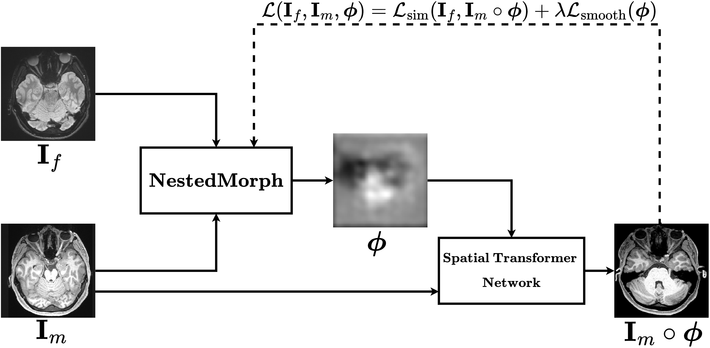

# NestedMorph: Deformable Medical Image Registration  

This repository implements the **NestedMorph** model, presented in the paper "[Kumar, Gurucharan Marthi Krishna, Mendola, Janine, Shmuel, Amir. "NestedMorph: Enhancing Deformable Medical Image Registration with Nested Attention Mechanisms." arXiv, 2024](https://arxiv.org/pdf/2410.02550)".

[](https://arxiv.org/abs/2410.02550)
[](https://opensource.org/licenses/MIT)

The NestedMorph framework combines advanced deep learning techniques for deformable medical image registration, leveraging Vision Transformer (ViT) and nested attention mechanisms to improve the accuracy and efficiency of image alignment.

## Key Features  
- **3D Deformable Image Registration:** Designed for volumetric medical images to capture complex anatomical variations.  
- **Attention-Based Architecture:** Utilizes multi-scale attention mechanisms to enhance feature extraction and alignment.  
- **Spatial Transformer Integration:** Efficient warping of source images based on predicted deformation fields.  
- **Flexible Training:** Supports various loss functions (similarity metrics, regularization losses) and datasets.

## Overall Framework

The **Overall Framework** for NestedMorph combines multiple modules that work in synergy for medical image registration. The framework consists of the following key components:
- Image Preprocessing: Includes normalization, resizing, and augmentation of medical images.
- Model Architecture: Based on a Vision Transformer-based model with nested attention for improved feature extraction and registration accuracy.
- Loss Functions: Designed to optimize for both similarity metrics and geometric consistency between the source and target images.



## Model Architecture  
NestedMorph comprises:  
1. **Feature Extractor (Msa2Net):** Extracts multi-scale features from input image pairs.  
2. **Flow Estimation (Conv3D):** Predicts the deformation field for aligning the images.  
3. **Spatial Transformer:** Applies the deformation field to warp the source image.  

The model outputs:  
- **Registered Image:** The warped version of the source image, aligned to the target.  
- **Deformation Field:** Encodes the spatial transformation required for alignment.


## Models
This repository contains several models under the Models/ directory. Each model can be used for deformable medical image registration. Below are the available models:

- [CycleMorph](Models/CycleMorph) - A model for cycle-consistent registration.
- [MIDIR](Models/MIDIR) - Multi-scale Image Deformable Registration.
- [TransMorph](Models/TransMorph) - Transformer-based registration model.
- [ViT-V-Net](Models/ViT-V-Net) - Vision Transformer-based network for medical image registration.
- [VoxelMorph](Models/VoxelMorph) - A voxel-based deformable registration method.
- [NestedMorph](Models/NestedMorph) - Proposed Nested multi-scale deformable model.

## Data Directory Structure

The `data/` directory is structured as follows to organize training and testing datasets for deformable medical image registration:

### **Flowchart Diagram**

    Registration_Data/
    │
    ├── T1_Moving/                  # Directory for source images (e.g., T1-weighted MRI scans)
    │   ├── subject1_t1.pkl         # Pickle files containing source images (e.g., T1 image for subject 1)
    │   ├── subject2_t1.pkl         # Pickle files containing source images (e.g., T1 image for subject 2)
    │   └── ...
    │
    ├── Diffusion_Fixed/            # Directory for target images (e.g., DWI or atlas images)
    │   ├── subject1_dwi.pkl        # Pickle files containing target images (e.g., DWI image for subject 1)
    │   ├── subject2_dwi.pkl        # Pickle files containing target images (e.g., DWI image for subject 2)
    │   └── ...

- T1_Moving/: Contains the source images for registration. These could be T1-weighted MRI scans or any other type of image that you're using as the "moving" image.
- Diffusion_Fixed/: Contains the target images for registration. These could be Diffusion Weighted Imaging (DWI) scans or any other type of image that you're using as the "fixed" image.
  
Each subjectID_t1.pkl file should match a corresponding subjectID_dwi.pkl file for proper pairing in the registration tasks.

## Installation  

### Prerequisites  
- Python 3.8+  
- CUDA-enabled GPU (optional but recommended)  
- Dependencies: PyTorch, NumPy, SciPy, Matplotlib  

### Setup  
1. Clone the repository:  
   ```bash  
   git clone https://github.com/your-repo/NestedMorph.git  
   cd NestedMorph

2. Install dependencies:
   ```bash
   pip install -r requirements.txt
   
3. Training
To train the NestedMorph model, navigate to its directory under /Models/ and run:
    ```bash
    python train_nestedmorph.py --t1_dir ./Registration_Data/T1_Moving/ --dwi_dir ./Registration_Data/Diffusion_Fixed/ --epochs 100 --img_size 128,128,128 --lr 2e-4 --batch_size 2 --cont_training

## Registration Results

This section presents the **Registration Results** achieved by the NestedMorph model on various datasets, including brain MRI and other medical image modalities. The results demonstrate the effectiveness of the NestedMorph model in performing deformable image registration, particularly in terms of accuracy and computational efficiency.


## Citation 

If you find this code is useful in your research, please consider to cite:

    @article{kumar2024nestedmorph,
      title={NestedMorph: Enhancing Deformable Medical Image Registration with Nested Attention Mechanisms},
      author={Kumar, Gurucharan Marthi Krishna and Mendola, Janine and Shmuel, Amir},
      journal={arXiv preprint arXiv:2410.02550},
      year={2024}
    }
